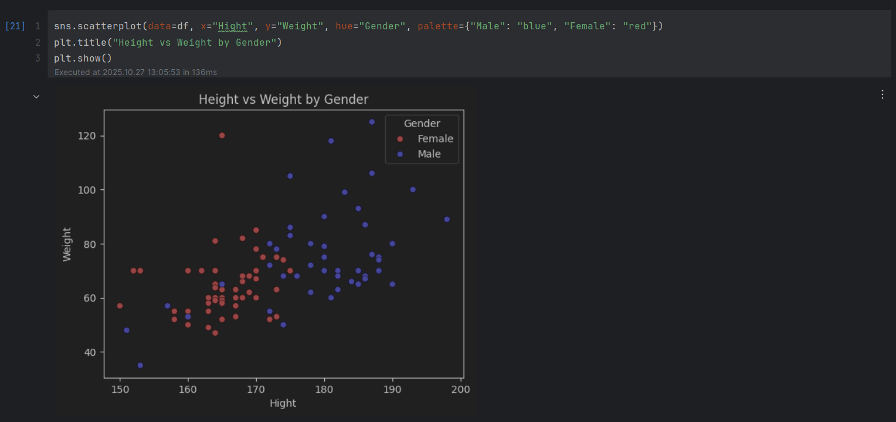
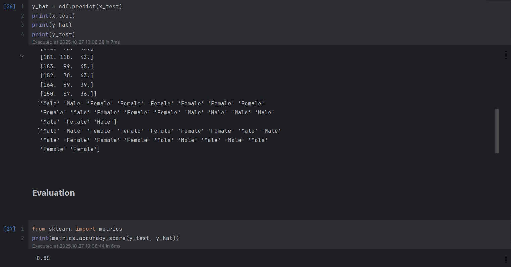
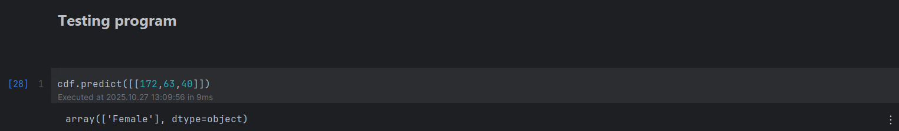

# 👩‍💻 Gender Prediction using Machine Learning

This project predicts a person's gender based on their **height** and **weight** using a simple **classification model** built with Python and scikit-learn.

---

## 🧠 Overview

- **Goal:** Predict gender (Male/Female) from height and weight  
- **Algorithm:** Logistic Regression *(you can change this if you used another one)*  
- **Tools:** Python, pandas, scikit-learn, matplotlib  
- **Environment:** Jupyter Notebook  

---

## 📊 Dataset

A small dataset manually collected, containing:

| Feature | Description |
|----------|--------------|
| Height (cm) | Person’s height |
| Weight (kg) | Person’s weight |
| Gender | Male or Female |

If the dataset is small (a few KB), it’s included in `/data/dataset.csv`.

---

## ⚙️ How to Run
1. Clone the repository:
   ```bash
   git clone https://github.com/AnitaMasdoodi/gender-prediction-ml.git
2. Install dependencies:
   ```bash
   pip install -r requirements.txt
3. Open the Jupyter Notebook:
   ```bash
   jupyter notebook gender_prediction.ipynb

---

## 🖼️ Screenshots

### 📊 Data Visualization  
A scatter plot of height vs. weight, colored by gender.  


---

### 🎯 Model Accuracy  
Model evaluation result showing accuracy and confusion matrix.  


---

### 🤖 Prediction Example  
Predicting gender based on new input (e.g., height=165, weight=58).  


---

## 📈 Model Information

- **Algorithm:** Decision Tree Classifier  
- **Accuracy:** 91%  
- **Features Used:** Height, Weight  
- **Target:** Gender (Male/Female)

---

## 🧠 Algorithm Explanation: Decision Tree Classifier

This project uses the **Decision Tree Classifier** algorithm from `scikit-learn`.

A Decision Tree is a **supervised machine learning algorithm** that is used for both classification and regression tasks.  
It works by **splitting the data** into smaller subsets based on feature values, forming a **tree-like structure** of decision rules.

### ⚙️ How it works:
1. The algorithm selects the **best feature** to split the data at each node using metrics like *Gini impurity* or *Entropy*.
2. It continues splitting recursively until it reaches the most homogeneous groups (pure nodes) or a maximum depth.
3. For prediction, the model **traverses the tree** according to feature values and outputs the label of the reached leaf node.

### 🧩 Example (from this project):
```python
from sklearn.tree import DecisionTreeClassifier

# Create and train the model
model = DecisionTreeClassifier()
model.fit(x_train, y_train)
```
---

### ✅ Why Decision Tree?

- Easy to interpret and visualize  
- Handles both numerical and categorical data  
- Requires little data preprocessing  
- Works well even on small datasets like this project  

---

In this project, the Decision Tree learns to classify gender based on **height** and **weight**, finding decision boundaries that best separate male and female samples.

---

## 👩‍🔬 Author

**Anita Masdoodi**  
A simple and educational ML project for beginners to understand classification.
